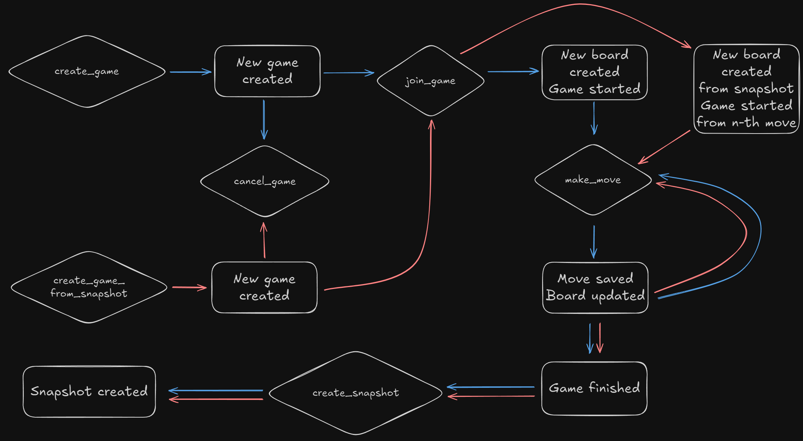
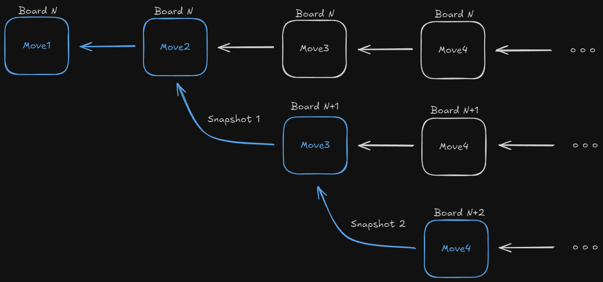
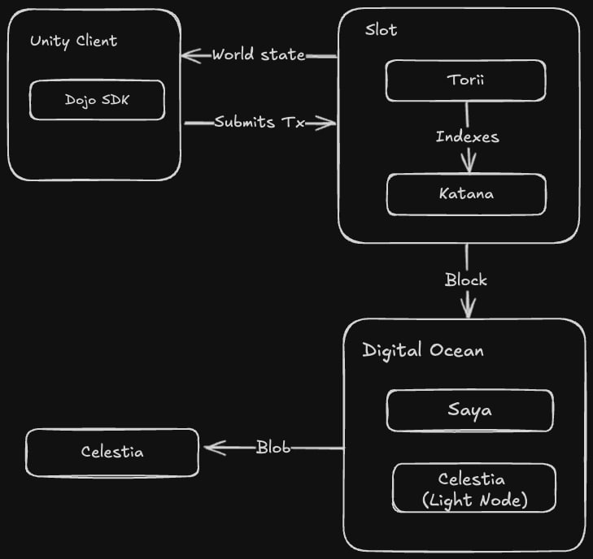

# Evolute Kingdom: Mage Duel

Evolute Kingdom: Mage Duel is an on-chain game, built on Starknet using the [Dojo Engine](https://github.com/dojoengine/dojo)

# Development Setup

To start development, install `cairo` and the necessary toolchain using the [Cairo installation guide](https://book.cairo-lang.org/ch01-01-installation.html). Then, install the latest Dojo toolchain by following the [Dojo installation guide](https://book.dojoengine.org/getting-started). After setup, you will have access to:

- [Sozo](https://book.dojoengine.org/toolchain/sozo) – the development tool for building and deploying smart contracts.
- [Katana](https://book.dojoengine.org/toolchain/katana) – a local Starknet sequencer for testing.
- [Torii](https://book.dojoengine.org/toolchain/torii) – an indexer for querying on-chain data.

# **Building and Running the Project**

1. **Build the project**
    
    ```bash
    sozo build
    ```
    
2. **Start the Starknet sequencer (Katana) in development mode**
    
    ```bash
    katana --dev --dev.no-fee
    ```
    
3. **Migrate the world** (deploy contracts to Katana and obtain the world address)
    
    ```bash
    sozo migrate
    ```
    
    Example output:
    
    ```bash
    🌍 World deployed at block 2 with txn hash: 0x0586002f82db7f903d2fc60edafde45a23d2e40d37dd4192e1d2952fc61c254f
    ⛩️  Migration successful with world at address 0x06a4d87ac4a224fbc633b46ec896545f8783cfc6d87ce8a4ef8c5630a3c17711
    ```
    
4. **Start the Torii indexer**
    
    ```bash
    torii --world <World Address>
    ```
    
    - This launches:
        - A GraphQL API at `http://localhost:8080/graphql`
        - A gRPC API at `http://localhost:8080`
5. **Interact with the game using Sozo scripts**
Predefined scripts in `Scarb.toml` allow local testing:
    
    ```bash
    #Creates the game by predeployed player account
    scarb run create_game
    
    #Joins the game from another player account and game started
    scarb run join_game
    
    #First player makes a move
    scarb run make_move1
    
    #Second player makes a move
    scarb run make_move2
    # and so on...
    ```
    

# Game rules

Two mages stand against each other, not to destroy, but to create. Their power, **Evolute**, grants them the ability to shape matter itself — forming **Cities**, **Roads**, and **Fields** from pure magic. 

Each move is a step toward building a greater world, but in the end, only one will prevail.

For detailed rules, check our [playbook](https://evolute.notion.site/playbook).

# Matchmaking

Matchmaking works as follows:

- One player creates a game.
- The second player sees the game in the list and joins.
- The first player can cancel the game before another player joins.
- When the second player joins, a board is generated with random parameters, and the game begins.
- Once the game starts, it cannot be canceled, nor can a third player join.
- A player can only participate in one game at a time.

# Snapshots

Once a game has ended, a player can create a snapshot of the match by specifying the board ID and move number. This snapshot captures the state of the game at that moment.

Using this snapshot, a new game can be started from that specific point, allowing two players to continue playing from an existing game state.

The matchmaking rules remain the same, except that the board parameters are pre-defined, and players begin from the recorded move instead of starting from scratch.



# Architectural Decisions & Challenges

## Event Sourcing for Snapshots

To enable snapshots, we implemented an **event sourcing model** for moves. Each move is stored along with a reference to the previous move, allowing us to reconstruct the board state at any point in time. This approach also makes it easy to implement snapshots as forks from the main board.



## Disjoint-Set Data Structure for Scoring

To handle score calculations for contested cities and roads, we implemented a **custom Disjoint-Set data structure**. This allows us to efficiently merge roads and cities into sets while simultaneously updating each player's score and tracking the number of open edges in each set.

## Modular Rule System

We separated the game rules into an independent model, allowing us to modify rules dynamically without affecting the core game logic. This approach offers flexibility for introducing the number of cities and roads spawned on edges, the number of each type of tile in the deck, and the number of jokers without requiring a complete overhaul of the system.

## Randomized Tile Draw Mechanism

To prevent players from predicting the order of tile draws, we implemented a system where only the top tile of the deck is revealed randomly each turn. The randomization is enforced through blockchain-based entropy, ensuring fairness and unpredictability in tile distribution. This ensures that the sequence of upcoming tiles remains unknown, maintaining strategic depth and preventing players from planning moves too far in advance.

# Sovereign World

To deploy the game, we set up a dedicated **sovereign world** infrastructure:

- On **Slot**, we deployed the **Katana sequencer** and **Torii indexer**.
- On **DigitalOcean**, we deployed a **Celestia light node** and **Saya**, which:
    - Fetches blocks from Katana.
    - Proves the blocks.
    - Sends proofs to Celestia for verification.
- The **game UI** interacts with Katana and Torii running on Slot, ensuring smooth gameplay and data retrieval.

This architecture ensures decentralization, security, and efficient game state verification.

