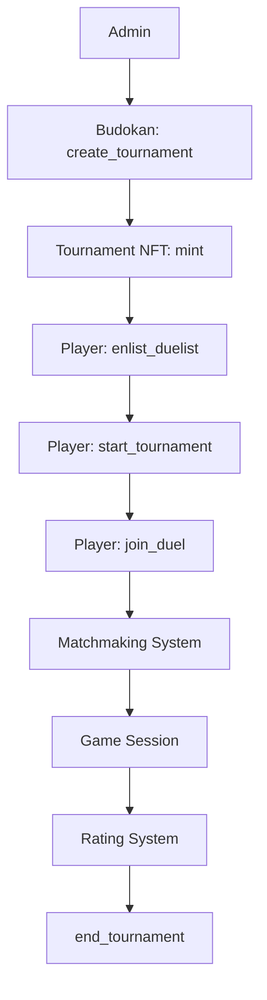

# Territory Wars - Tournament System

## System Overview

Territory Wars uses an integrated tournament system consisting of two main components:

1. **Budokan** - external tournament management system (fork of [tournaments](https://github.com/evolute-studio/budokan-tournaments))
2. **Tournament Token** - NFT contract for tournament passes with game logic integration

## System Architecture



### Key Components:

- **Budokan Tournament Contract** - tournament management, prizes, scheduling
- **Tournament Token Contract** - NFT passes, game logic integration
- **Matchmaking System** - automatic opponent finding
- **Token Economy** - EVLT/eEVLT for game payments
- **Rating System** - ELO-based rating system

---

## For Administrators

### 1. Creating Tournament in Budokan

Tournaments are created through the Budokan contract using the `create_tournament()` function.

#### Creation Parameters:

```cairo
fn create_tournament(
    creator_rewards_address: ContractAddress,  // Address for creator rewards
    metadata: Metadata,                        // Tournament name and description
    schedule: Schedule,                        // Time schedule
    game_config: GameConfig,                   // Game settings
    entry_fee: Option<EntryFee>,              // Optional entry fee
    entry_requirement: Option<EntryRequirement>, // Entry requirements
) -> Tournament
```

#### Data Structures:

##### Metadata
```cairo
struct Metadata {
    name: felt252,           // Tournament name (up to 31 characters)
    description: ByteArray,  // Tournament description
}
```

##### Schedule
```cairo
struct Schedule {
    registration: Option<Period>,  // Registration period (optional)
    game: Period,                  // Game period
    submission_duration: u64,      // Score submission time (seconds)
}

struct Period {
    start: u64,  // Start time (Unix timestamp)
    end: u64,    // End time (Unix timestamp)
}
```

##### GameConfig
```cairo
struct GameConfig {
    address: ContractAddress,  // Tournament Token contract address
    settings_id: u32,         // Game settings ID (always 1)
    prize_spots: u8,          // Number of prize spots
}
```

##### EntryFee (optional)
```cairo
struct EntryFee {
    token_address: ContractAddress,  // Payment token address
    amount: u128,                    // Entry fee amount
    distribution: Span<u8>,          // Prize distribution percentages
    tournament_creator_share: Option<u8>,  // Tournament creator share (%)
    game_creator_share: Option<u8>,        // Game creator share (%)
}
```

##### EntryRequirement (optional)
```cairo
struct EntryRequirement {
    entry_limit: u8,                           // Participant limit
    entry_requirement_type: EntryRequirementType,
}

enum EntryRequirementType {
    token: ContractAddress,        // Token ownership requirement
    tournament: TournamentType,    // Other tournament participation requirement
    allowlist: Span<ContractAddress>, // Address allowlist
}
```

#### Example Tournament Creation Command:

```bash
# Simple tournament without restrictions
sozo execute budokan-tournament create_tournament \
  --creator_rewards_address 0x127fd5f1fe78a71f8bcd1fec63e3fe2f0486b6ecd5c86a0466c3a21fa5cfcec \
  --metadata '{"name": "Weekly Tournament", "description": "Weekly rating tournament"}' \
  --schedule '{"registration": null, "game": {"start": 1640995200, "end": 1641081600}, "submission_duration": 3600}' \
  --game_config '{"address": "TOURNAMENT_TOKEN_ADDRESS", "settings_id": 1, "prize_spots": 10}' \
  --entry_fee null \
  --entry_requirement null \
  --account-address 0x127fd5f1fe78a71f8bcd1fec63e3fe2f0486b6ecd5c86a0466c3a21fa5cfcec \
  --private-key 0xc5b2fcab997346f3ea1c00b002ecf6f382c5f9c9659a3894eb783c5320f912
```

### 2. Tournament Token Configuration

After creating a tournament in Budokan, Tournament Token automatically creates passes (NFTs) for participants.

#### Important Settings:

- `base_uri` - base URI for NFT metadata (configured in dojo_init)
- Connection to Budokan via `game_config.address`
- Automatic integration with matchmaking system

---

## For Players

### Tournament Phases

Territory Wars tournaments go through 4 main phases:

#### Phase 1: Enlist Duelist (Tournament Registration)

Player registers in the tournament with Tournament Token.

```cairo
fn enlist_duelist(pass_id: u64)
```

**Requirements:**
- Own Tournament Token NFT
- Token not yet used for registration

**What happens:**
- Player is bound to tournament
- Tournament rating is initialized
- Index is created for quick lookup

```bash
sozo execute evolute_duel-tournament_token enlist_duelist <pass_id> \
  --account-address YOUR_ADDRESS \
  --private-key YOUR_PRIVATE_KEY
```

#### Phase 2: Start Tournament (Tournament Launch)

Any registered participant can start the tournament.

```cairo
fn start_tournament(pass_id: u64) -> u64
```

**Requirements:**
- Own Tournament Token NFT
- Tournament in correct lifecycle phase
- Tournament not yet started

```bash
sozo execute evolute_duel-tournament_token start_tournament <pass_id> \
  --account-address YOUR_ADDRESS \
  --private-key YOUR_PRIVATE_KEY
```

#### Phase 3: Join Duel (Game Participation)

Main phase - players play matches through automatic matchmaking.

```cairo
fn join_duel(pass_id: u64) -> felt252
```

**Requirements:**
- Own Tournament Token NFT
- Registered in tournament (enlist_duelist executed)
- Tournament started
- Have eEVLT or EVLT tokens for payment

**Game Economy:**
- eEVLT tokens (tournament-specific) are spent first
- If no eEVLT, EVLT tokens (main) are spent
- 1 token = 1 game

**What happens:**
- System finds opponent through matchmaking
- Game session is created
- Tournament rating is updated after game

```bash
sozo execute evolute_duel-tournament_token join_duel <pass_id> \
  --account-address YOUR_ADDRESS \
  --private-key YOUR_PRIVATE_KEY
```

#### Phase 4: End Tournament (Tournament Completion)

Any participant can end the tournament when time expires.

```cairo
fn end_tournament(pass_id: u64) -> u64
```

**Requirements:**
- Own Tournament Token NFT
- Registered in tournament
- Tournament time expired (no longer playable)

```bash
sozo execute evolute_duel-tournament_token end_tournament <pass_id> \
  --account-address YOUR_ADDRESS \
  --private-key YOUR_PRIVATE_KEY
```

---

## Tournament Tokenomics

### Token Types:

1. **EVLT Token** - main game token
2. **eEVLT Balance** - tournament tokens (specific to each tournament)
3. **Tournament Token NFT** - tournament passes

### Game Payment System:

1. When calling `join_duel()`, eEVLT balance is checked for the tournament
2. If eEVLT exists - 1 eEVLT token is spent
3. If no eEVLT - 1 EVLT token is spent
4. If neither available - `INSUFFICIENT_TOKENS` error

### eEVLT Balance Management:

eEVLT tokens are minted through other game systems and allow free tournament play.

```cairo
// Tournament balance model
struct TournamentBalance {
    player_address: ContractAddress,
    tournament_id: u64,
    eevlt_balance: u32,  // Number of games available in tournament
}
```

---

## Matchmaking and Rating System

### Automatic Matchmaking

Tournament system integrates with universal matchmaking system:

```cairo
fn auto_match(game_mode: u8, tournament_id: Option<u64>) -> felt252
```

- `game_mode: GameMode::Tournament.into()` (value for tournament mode)  
- `tournament_id: Some(tournament_id)` - current tournament ID
- Returns `board_id` if opponent found, `0` if waiting in queue

### Rating System

Each tournament participant has separate tournament rating:

```cairo
struct TournamentPass {
    // ... other fields
    rating: u32,        // Current tournament rating (ELO)
    games_played: u32,  // Games played in tournament
    wins: u32,         // Wins in tournament  
    losses: u32,       // Losses in tournament
}
```

Rating is initialized at `enlist_duelist()` and updated after each game.

---

## Client Integration

### TypeScript Interface

For client code integration, use `ITournamentDispatcher`:

```typescript
// Get Budokan dispatcher
const budokanDispatcher = world.ITournamentDispatcher(budokan_address);

// Create tournament
const tournament = await budokanDispatcher.create_tournament({
  creator_rewards_address,
  metadata: { name: "Tournament Name", description: "Description" },
  schedule: { 
    registration: null, 
    game: { start: startTime, end: endTime },
    submission_duration: 3600 
  },
  game_config: { 
    address: tournament_token_address,
    settings_id: 1,
    prize_spots: 10 
  },
  entry_fee: null,
  entry_requirement: null
});

// Work with Tournament Token
const tournamentToken = world.ITournamentTokenDispatcher(tournament_token_address);

// Register player
await tournamentToken.enlist_duelist(pass_id);

// Participate in games  
const board_id = await tournamentToken.join_duel(pass_id);
```

### Tournament State Monitoring

```typescript
// Check action possibilities
const canEnlist = await tournamentToken.can_enlist_duelist(pass_id);
const canStart = await tournamentToken.can_start_tournament(pass_id);  
const canJoin = await tournamentToken.can_join_duel(pass_id);
const canEnd = await tournamentToken.can_end_tournament(pass_id);

// Get tournament information
const tournament = await budokanDispatcher.tournament(tournament_id);
const registration = await budokanDispatcher.get_registration(token_address, pass_id);
```

---

## Practical Examples

### Complete Tournament Cycle:

```bash
# 1. Administrator creates tournament in Budokan
sozo execute budokan-tournament create_tournament [parameters...]

# 2. Players get Tournament Token NFT (automatically or through mint)

# 3. Player registers in tournament
sozo execute evolute_duel-tournament_token enlist_duelist 1 \
  --account-address 0x123... --private-key 0x456...

# 4. Any participant starts tournament
sozo execute evolute_duel-tournament_token start_tournament 1 \
  --account-address 0x123... --private-key 0x456...

# 5. Players participate in games
sozo execute evolute_duel-tournament_token join_duel 1 \
  --account-address 0x123... --private-key 0x456...

# 6. After time expires - end tournament
sozo execute evolute_duel-tournament_token end_tournament 1 \
  --account-address 0x123... --private-key 0x456...
```

### Check Token Balances:

```bash
# Check EVLT balance
sozo execute evolute_duel-evlt_token balance_of 0x123...

# Check eEVLT balance for tournament
sozo model get evolute_duel-TournamentBalance 0x123... <tournament_id>

# Check Tournament Token ownership
sozo execute evolute_duel-tournament_token owner_of <pass_id>
```

---

## Troubleshooting

### Common Errors:

- `NOT_YOUR_ENTRY` - don't own Tournament Token NFT
- `ALREADY_ENLISTED` - already registered in tournament
- `NOT_ENLISTED` - not registered in tournament
- `ALREADY_STARTED` - tournament already started
- `NOT_STARTED` - tournament not yet started
- `HAS_ENDED` - tournament already ended  
- `INSUFFICIENT_TOKENS` - insufficient EVLT/eEVLT tokens
- `BUDOKAN_NOT_PLAYABLE` - tournament not in playable phase

### Check Tournament State:

```bash
# Current tournament phase in Budokan
sozo execute budokan-tournament current_phase <tournament_id>

# Registration information
sozo execute budokan-tournament get_registration <tournament_token_address> <pass_id>

# Tournament Pass information
sozo model get evolute_duel-TournamentPass <pass_id>
```